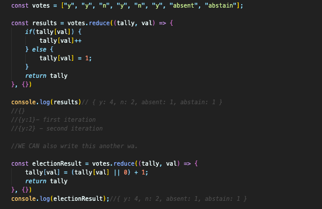

## GOALS FOR THE SECTION

Use the new arrow function syntax, understand and use the following methods

1. forEach
2. map
3. filter
4. find
5. reduce
6. some
7. every

### INTRODUCTION TO ARRAY CALLBACK METHODS

In this section we are going to look at some of the most useful methods that expect us to put a function in. This section is focused on array methods that expect a callback. Arrays come with many built-in methods that accept callback functions. Now that we've covered callbacks, we can learn these methods. They are super useful! The general pattern here is that we are going to run a function once per element in each array.  each method will have different goals. The methods we see here are going to be used all the time. 

### FOREACH

For each accepts a callback function and calls the function once per element in the array. 
When we don't want to repeat a function we can use a annonymous function!

### MAP 

Creates a new array with the results of calling a callback on every element in the array. 
It can be used to take bits of an array or do other cool things with an array. 

### ARROW FUNCTIONS INTRO

Arrow functions are a syntactically compact alternative to a regular function expression.  Arrow functions are not only syntactically different.  They also function differently when using the keyword .this 
Although besides this, they are just a faster way to write functions. Paranthesis is an option if they's only one argument. We use empty paranethisis if we have a function with no arguments. 

### ARROW FUNCTIONS: IMPLICIT RETURNS

There is an even more compact way to write arrow functions. This is through implicit return  Arrow functions are just a shorter version of a regular function expression.  They are just more compact, even though they have the same functionality. 

ALL THESE FUNCTIONS DO EXACTLY THE SAME THING JUST WITH DIFFERENT SYNTAX.

### ARRAY.FIND

Returns the value of the first element in the array that satisfies the provided testing function.

### FILTER

filer is another array method that expects a callback function. Filter creates a new array with all elements that pass the test implemented by the provided function.  Filter allows us to filter out subsets of arrays. Bascially, we pass in a test function that is either true or false.  if an element passes that function, it will be passed to the return array. It doesn't change the original array, we are making a copy with our filtered elements. 

### SOME AND EVERY

Both of the these methods return a boolean true of false. 
Every- tests whether all ements in the array pass the provided function. It returns a boolean value. 
Some- similar to every, but returns true if ANY of the array elements pass the test function. 

### REVISITING SORT!

The default behaviour for sort, without any arguments is for sort to create a string of all our array elements and then sort them that way. 

In order to customise the behaviour of sort we use compare functions.  These functions have two parameters, and we return a value from the compareFunc function. 

if compareFunction(a, b) returns less than 0 - sort before b 
if compareFunction(a, b) returns 0- leave a and b unchanged with respect to each other.
if compareFunction(a, b) returnsreturns greater than 0- sort b before a 

### REDUCE INTRO

Reduce is a build in array method, we pass a call back to it, let we have done with all our other array methods. 

Reduce is a bit different. It is very useful and versitile, although it's a little tricky to explain. Reduce is something i need to practice in order to get good at it. 

Reduce takes an array of values and reduces it down to a single value. Reduce executes a reducer function on each element of the array, resulting in a single value.  Each element is combined and reduced down to a single element.  An application for the reduce method is summing an array for example.  We could use reducer to find the maximum value in an array.  Or reduce an array from 100 numbers down to a single maximum. It could be used to tally data within an array. We are taking a bunch of values and reducing this down to a single value. 

### REDUCE PART 2 

We have seen reduced used in a simple way, however we can use reduce in more complex ways. We can use REDUCE to find the maximum value in an array.  We can use REDUCE not only to multiply, or sum things together, but to keep track of some piece of data! We can pass in an initial value, as the second argument in reduce! 

### EVEN MORE REDUCE! 

We can use Reduce to tally up the results of an array. We can group different values in an array using an object. 

