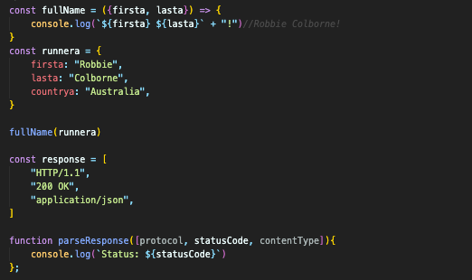

## THE GOALS OF THIS SECTION 

1.  Work with rest 
2. Work with spread
3. Add default function paramaters 
4. Understand destructuring 

### DEFAULT PARAMETERS 

deafult parameters have to come at the end of our of our paramater list! We can have the first element default and then not default afterwards! We can have as many as we want, although, if we have heaps we are likely not using the best solution! 

### SPREAD FOR FUNCTION CALLS 

Spread syntax allow an iterable such as an array to be expanded in place where zero or more arguments (for function calls) or elements (for array literals) are expected, or an object expression to be expanded in places where zero or more key-value pairs (for object literals) are expected. 

Spread always has to do with expanding some iterable into some other destination. We are spreading/expanding something. 

When we use spread in a function call, it will take that iterable, and break it up into individual arguments. Spread is not only applicable to arrays, we can also use it on strings and the like. 

### SPREAD IN ARRAY LITERALS  

Creates a new array using an existing array. Spreads the elements from one array into a new array. Individual pieces are taken and copied into a new destination array. We can use it to combined arrays make copies of arrays and in my other use cases. One of the most common use cases for the spread operator is when we want to make a copy of an array. That however does not work with nested arrays! 

### SPREAD IN OBJECT LITERALS  

Copies properties from one object into another object literal.  Spread only works if we use something that is iterable! 

### REST - THE ARGUMENTS OBJECT 

Rest looks a lot like spread but its not! This is because it has the same syntax ... 
Rest behaves very differently from spread. It is almost the opposite. What it does is collects data down into a single array. It is used when we want to create functions that have an unlimited amount of arguments, or a variable number of arguments. 

The  arguments object, is available inside every function. It's an array-like object. It has a length property. Does not have array methods. Contains all the arguments passed to the function. Not available inside of arrow functions!

### REST PARAMETERS 

Rest is ... but we put it in the paramatter list of a function. It collects all remaining arguments into an array. 

USING REST. 

1. we use ...
2. we use a name. This will be the name of the array which holds all our arguments.

### DESTRUCTURING ARRAYS 

A short, clean syntax to "unpack": values from arrays. properties from objects into distinct variables. 

### DESTRUCTURING OBJECTS 

In an object, we make the variables based of the name of the property. 

### NESTED DESTRUCTURING 

### DESTRUCTURING PARAMETERS 

One more place we often see destructuring used, is inside a function definition where the paramaters are listed.  If we put it in a function definition it will unpack values from the arguments that we pass in. 

