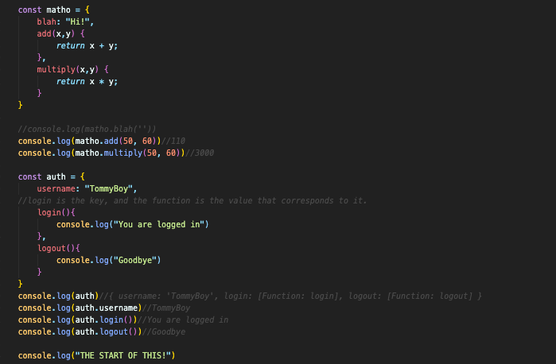
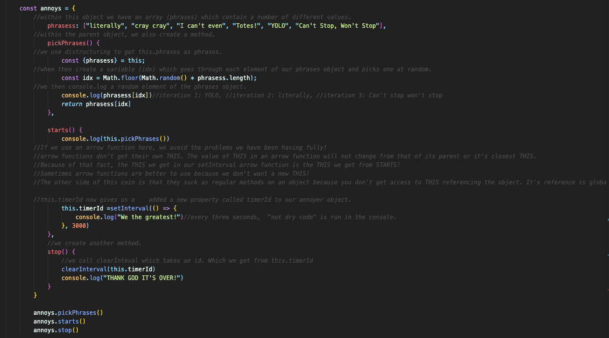

## GOALS FOR THE SECTION 

So far we have seen the basic of objects. So far have seen object literals, but there is much more to talk about with objects.
Objects are very central to the way Javascript works, not only as developers but behind the scenes as well. 

1. Add methods to objects 
2.  Use new object Shorthand syntax
3. use computed properties 
4. Understand protoypes 
5. explain how THIS works

### Shorthand Object Properties 

Shorthand properties, are a new addition to JS (es2015), not supported in internet explorer.  It is an easy way to create an object literal when we have variables.  And we want to create a property where the key name is the name of the variable and the value is the value in the variable.  

### Computed Properties 

Computed properties are an improvement, for the object literal syntax. We can add a property with a dynamic key. 

### Adding Methods To Objects 

We can add functions as properties on objects! We call this methods!
The reason we do this, firstly, is to group functions together, and put functions into cohesieve units. When we define a function on it's own and add in an object, and call it with the dot notation we are creating a method! 

### Method Shorthand Syntax

We can use an arrow function although this is not that common. In addition, there is a nice new short hand for adding a method to an object, where we don't have to use the key value pair syntax. 

### Intro to keyword THIS 

This - The keyword this can be a major point of confusion and misery and hardship, and general suffering in the life of a new JS developer. 

This- is one of the keys to writting useful methods on our objects. 

This- is also pretty useful once we get to DOM manipulation. When we do things like add events, or click events and the like. 

In reality, this is not that bad. What is tricky, is that sometimes the value may seem unpridictable. There are a set of concrete rules that dictate, what the value of THIS is. 

THIS is a keyword. It's a reference to the current execusions scope. It returns an object. Depending on the scope and the rules of how THIS works, that object changes. It could be a reference to the global scope for example. 

### Using THIS in methods 

Now we are going to see where THIS becomes far more useful.

### THIS: Invocation Context

The value of THIS depends on the invocation context of the function it is used in. 

We have seen two different values for THIS so far. 

1. We have seen that in a regular old function, THIS refers to the global state.
2. When we use THIS inside a method, its a way of accessing the parent object. The object the method is located in. 

However, this is not always the case. The value of THIS depends on the inovcation context of the function its use in. This means, the value will change depending on how the function is actually executed. NOT JUST WHERE YOU WRITE IT. It depends how we call it! THIS is a bit of a shape shifter in some ways! 

Generally, when we call the THIS method, we are going to be using the dot syntax. 

When we write an arrow function, arrow functions do not get there own version of THIS. the value of THIS is not going to change! Generally, we don't write methods usings arrow functions! 

The value of THIS is not set in stone, soley based on where we write it.

### Annoyomatic DEMO

We are going to talk more about arrow functions and THIS. 

### Putting It All Together: Deck of Cards 

In this video, we will not be using any new syntax or features of JS. We are just going to get in some practice, and talk about objects, methods, designing our code, and comparing that to different approaches we have already scene

