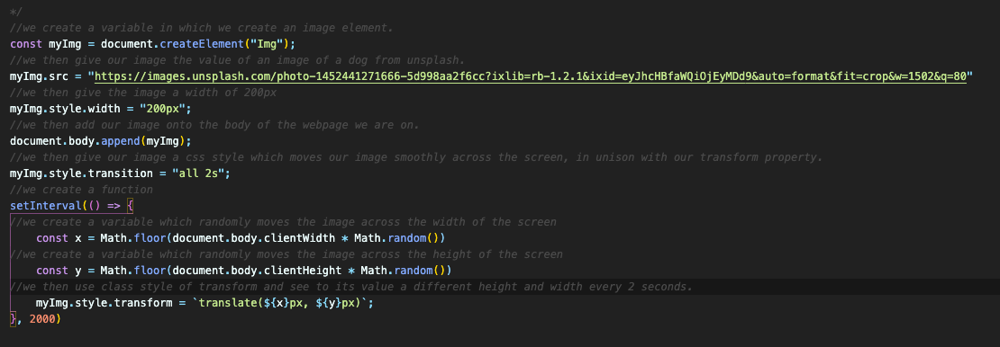
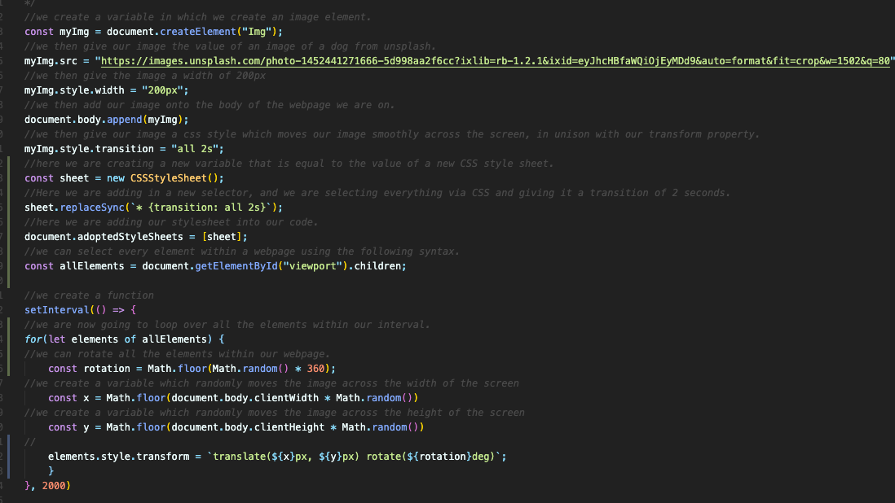
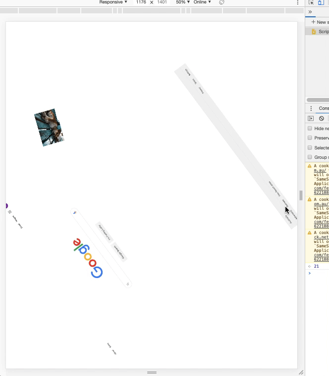
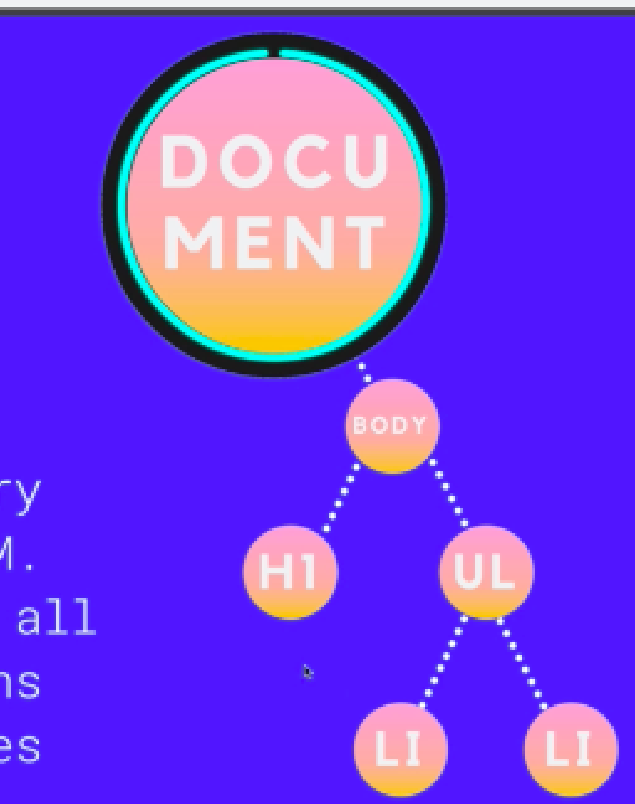
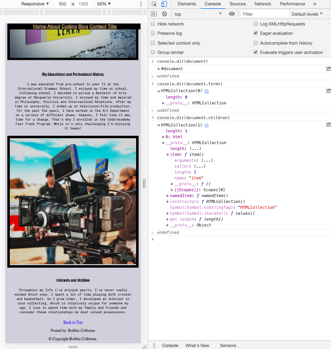
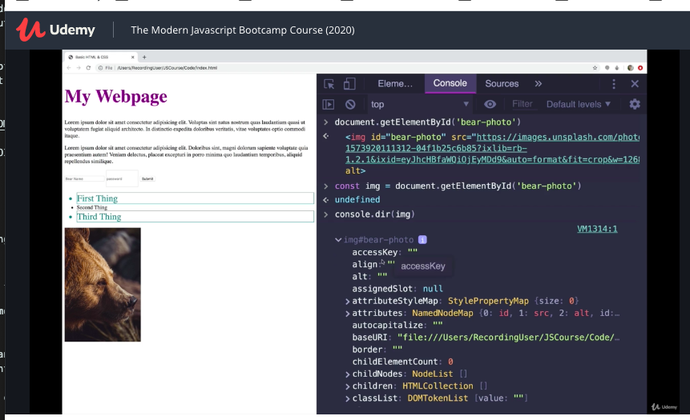
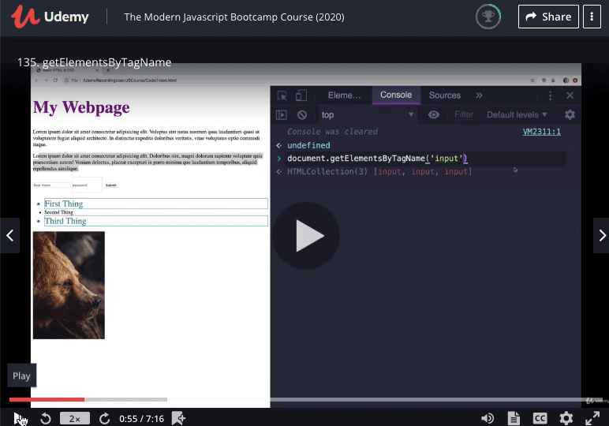
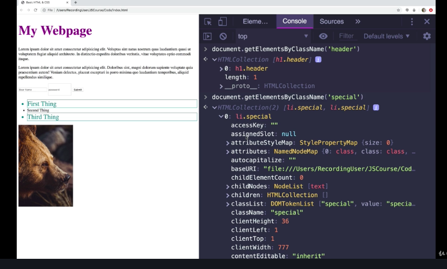
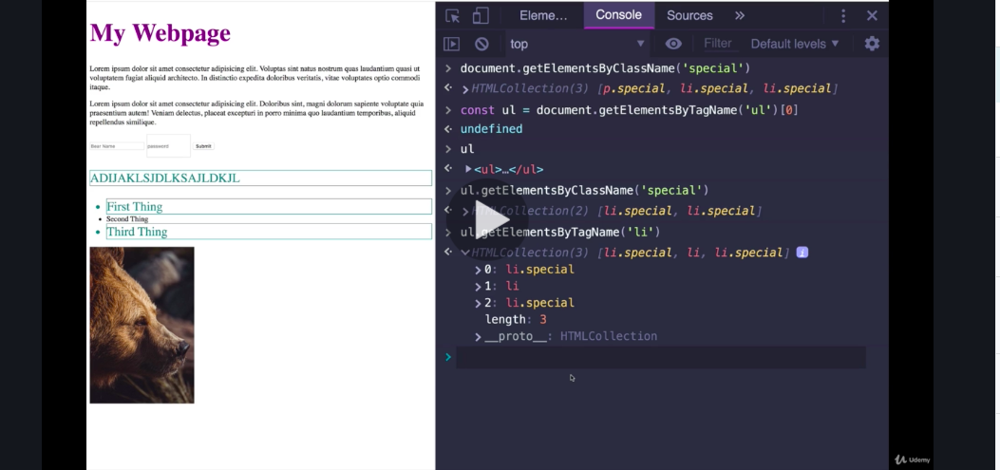

#### INTRODUCTION TO THE DOM

##### The DOM stands for Document Object Model (DOM)

Through the DOM we connect Javascript to HTML and CSS. 
This is where JS becomes more visual and we can make stuff that we can actually see! 
There is a lot to cover in terms of the DOM! 

Javascript helps to give our webpages an interactive element! 

Javascript in a way gives our websites a life! and can help to make our pages interactive and more user friendly! 

Javascript can be used to put logic into our applications. 

All the interactivity on our websites can be achieved through the use of Javascript.

Javascript and the DOM in very exciting stuff. 

This is where we start to take HTML and CSS and play with it using javascript. 

##### TASTE OF THE DOM- DOCUMENT OBJECT MODEL 

The DOM (Document Object Model), is a JavaScript representation of a webpage.
It's your JS "window into the contents of a webpage"
It's just a bunch of objects that you can interact with via JS. 

It is our portal into the world of JAVASCRIPT. So we can write JS to figure out how many h1 tags are on a page, 
 Or how many inputs we have in a form, or the value of a form, we could change the value of a form, we could change images, put in animations, 
 listen for clicks or drags, or hovers, or any event that is user generated and then respond to this event. 
 
 We add logic in with Javascript that controls, interacts, reads and understands the content of a page.

 The key thing to understand about all of this, is the object part of the DOM. 

 When our website loads-up, the broswer turns it into a bunch of OBJECTS.

 

 Just  JS objects, and these objects are all constructed and put together to form the DOM. 
 It is a virtual representation (or a js representation) of the content of a page, and consists of a bunch of JS objects. 

 HTML + CSS and some other stuff go in, and the browser interpreats it and reads it and creates the DOM for us. 
 It spits our JS objects, representing the HTML, CSS and other stuff. 

If we had a page of simple HTML, the browser will read it, on its own its just text, 
the browser interpreates and interpreats it into a way that is understandable to humans. 
The broswer reads it, makes it look nice for humans, and at the same time, creates a virtual representation. 
This virual representation is a JavaScript object of the different elements. For example, the h1 element becomes a JS object.
The h2 becomes another object, our ul becomes another and so on and so forth. 

These objects have a bunch of different properties. The simplest one, in their content. For example, 
h1 (this is made into a javascript object)>  How To Become a DOM Pro(this is the content and is made into a property of our object) h1

p (becomes a JS object)> Becoming a pro at DOM is not an easy thing (becomes a property (innerText) of the JS object that is the paragraph) p

Which have a bunch of other properties, for different attributes, CSS styles, we have methods that we can use, we could delete HTML elements update them and so on. 

This usability is all achieved through JS where we are able to interact with these objects. 

We can select and interact with these objects, we can change them in JavaScript. 
When we change an element in the DOM using JS, there is an impact that we can see, on our webpages. 

##### ANOTHER FUN DOM EXAMPLE 

We are going to play around with the home page of google. We are going to take every element from the screen, and animate it around randomly.
This is to show us the we can do things like change style, move things around, and animate them. 

Through our console, we can go to sources and create a new code snippet. We can then use this to customise a webpage and see how we can manipulate the DOM and its javascript objects. 

In this example, we have uploaded an image from unsplash, that moves around the page to another random spot every two seconds. 

The code for this, does the same thing as the gif, but it doesn't jump and moves more across the screen smoothly. 

We are already seeing a bunch of cool features we can use in the DOM! 

We can use this same logic to move every element on our screen! There are a number of ways to achieve this result. 

The purpose of all of this is to show us that we can select things, and play with them. These principles apply to everything we can do. We can interact with a form, get the value out, change an image source, add events, pick random things and mess with them, we can add new styles to a style sheet, we can do heaps! 

In the below example, we are able to get all the central elements of google and make them all act crazy using the following code! 

##### THE DOCUMENT OBJECT

The DOM stands for DOCUMENT OBJECT MODEL. The DOM is just a representation of an actually document, made with a bunch of objects and they are assembled into a tree. 

There is a hierarchy within the tree. The elements are not just setting there on the same level or in a random order. 

In every tree there is a top most branch which is called the root of the tree. 

Which when we work with the DOM is called document. 

document is an object that we have in every browser window that we open. 

The document contains heaps of properties and methods this is really where we start with everything. All the other pieces of the DOM are located within the document somewhere. It is all nested. 

it is always, 

document.(something)

for example, 

document.images (this shows the 5 images i have on my page), we can also keep adding on dot notation to get more information. For example, 

document.images.(something)

document.all returns all of our HTMLCollection(48 items)

document.all.1 (returns the information within the head of my html document)

The document is the entry point we use to access the DOM to manipulate things, to view content, but also add events and functionality its all located within the DOM. It's all created automatically, when a page is rendered within the browser. 

We can access a hold bunch of stuff through the DOM and by accessing the children of document element. Here are some examples from my old portfolio website. 

THE DOCUMENT IS THE ENTRY POINT! THIS IS WAY WE ALMOST ALWAYS START WITH DOCUMENT DOT SOMETHING! 

##### getElementById

We are going to start looking at some of the most important methods we have access to in the DOM. 

Selecting is very important in the DOM manipulation process. 

Typically, we select an element or multiple elements, and do something with them. 

When we want to add events and interactivties, we start with selecting.
There is a bunch of different ways to do this using the document. 

The first couple of ways we can select is using the following methods.

getElementByID
getElementbyTagName
getElementbyClassName 

getElementByID is a method on the document, we therefore call it the following way.

document.getElementByID

This method, takes an ID and finds the matching element that contains that id and returns that object.  

IF WE TYPE JUST document.getElementById("bear-photo") WE ARE RETURNED WITH JUST THE HTML FOR THAT CODE. 

However, if we store document.getElementById("bear-photo") into a variable we are able to see all the properties that exist for our photo. 

we can print these properties using the following code. 

console.dir(bear-photo)

When we call document.getElementById("pass in a string"), only if there is a match for that ID, we get that element back as an object, the DOM representation of that element, in our case an image. 

We will only ever get one element back, and if we pass in an invalid ID, we will recieve null. 

There are also different categories of elements within our pages. These are different patterns for these objects. For example, 

HTMLimageElement
HTMLparagraphElement 

##### getElementsByTagName

We select by a type of element. For example all the h1 on a page or all the images, or paragraphs on a page. With getElementsByTagName we could potentially get more than one element, depending on how many of these elements our page contains. These returned elements will be stored in a list.

In our example, we get three inputs elements returned. It looks like an array at first, but its not. Each one of these elements is a DOM object. 

HTMLinputElement

A HTMLCollection, is a collection of objects. It's a type of collection you often get from the DOM. It's not an array, although we can do arrayish things on them. We can also iterate using it. It's a very light weight structure. 

Since our HTML collections are iterable we can use the spread operator ...

At the end of the day, we end up looping over elements most often. 

##### getElementsByClassName

We use a lot of classes when we use CSS. In order to get access to these elements we call 

document.getElementsByClassName("ClassName")

This will return to us, all the elements that share that class name. 

If we try and get a class that doesn't exist, we will get an empty HTMLCollection[]

We don't also just have to call elements based on the document. If we wanted to select one element and search a child element within that element, we could do that in the following way. 

In the above example, we get our elements that have a tag name of "ul" and take the first element from that collection [0]. Which we save to a variable called "ul". When then use this variable, which is an object, which has its own copy of getElementsByClassName. So we can search for class names within our ul variable. This then returns the only elements that contain the class "special" within our "ul" variable. 

This will not work with getElementWithId, because IDs are supported to be individual. 

##### querySelector & querySelectorAll 

