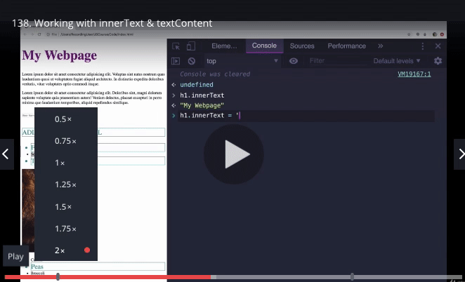
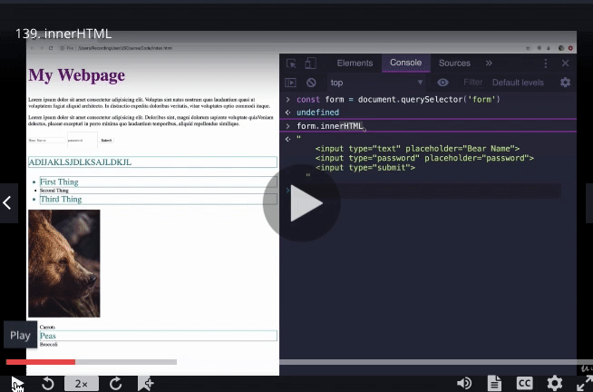

 

### Working With InnerText & textContent

Now that we have seen how to select elements, we usually want to use them. 
Manipulation is not exactly the best term, some times we will be manpulating elements (like changing colors), but other times we are just accessing data. What is the contents of this div? What number did the user just click on? 

We can narrow down the most important properties and methods of the dom that we need to know. 

 

These are the methods and properties that 95% of the time, we end up using. We use these to style elements, create new elements, change attributes, add class to an element, or remove a class from an element. There are so many different things that we can do. Using just these properties, we can by using the DOM. 

In this section, we are going to go through these properties and methods peace by peace. 

In this video, we are going talk about access text from an element. How do we get the contents from an element? 

#### innerText 

When we use innerText on an element, we get all of the text inside of it. 

It doesn't matter how many elements deep it is, or nested, it takes out all the text. 

We can change our text, it's just another property on an object, and if we change it, the browser is going to update to reflex that. 

Now this change is obivously only in the console. However, we could add it to a script and then it would run each time and we would see it. 

It is kind of silly to update the contents of a H1 whenever a new page loads. Why not just update the html? 

This is where events come in, in which we want to change information based on some sort of event taking place (a click or a hover for example). When can use innerText, when we want to update a heading for example. 

#### textContent 

On the surface, textContent seems the same as InnerText. They seem identical. 

However this is not the case, if look at innerText, we are given just the text of our HTML, there is not formatting, we don't get information about our script. Its just the text. 

Howevever, if we put in p.textContent, we get the text, the formatting and it returns the tefxt from our script.  Also, if we had something that was hidden within the paragraph, we can see it using textContent. 

### InnerHTML

Is going to retrieve, not only the text inside an element, but also all other tags within a given element.

For example, if we selected a form: 

form.InnerHTML we would recieve, all the elements contained within that form as a string.  

We get everything from one tag to another tag. 

If user InnerHTML, we get all of the content within our search paramaters. This is very different to our innerText works. We are given the html syntax, any css and so on when we use InnerHTML

We can use innerHTML, to change the contents between our two tags if we wanted to. We can also had HTML elements im using innerHTML as a string. 

InnerText, textContent, innerHTML, all these methods return strings. 

If we don't wanted to completely overide what elements we have in our DOM currently, we can use += to add other elements in. It is not that often that we would use this, but we can. 

There is also a difference between innerHTML and innerText when we set them. We have already seen the difference when we retrieve them. 

If we wanted to add a tag into our H1 tag (My Webpage) and we used innerText, they would not be read as a new element. Instead they would be seen as new text. Whereas, if we used innerHTML, it would be understood that this is a new tag and would be rendered the way we would like. 

If we are trying to add an element we need to use innerHTML.

With innerText, we cannot actually add new elements. 

### value, src, href, and more

These properties are grouped together as we can directly, access on individual elements. 

#### Value 

When we have a form and we want to retrieve the text input or some value from within the form, we have an attribute that allows us to achieve this. This attribute is value. 

value is how we can get the value out of a form. 

Usually, the way that we change input value, is to reset it to an empty string. This is like a search bar. Once you type it in an press enter, some new stuff loads, and you are taken to a new page, but then the search bar becomes empty again. 

That is value and checked, we also have direct access to placeholder. We can change placeholder directly, although this is not that common. This is how we can work with inputs. 

#### href 

The href tag allows us to link of our images, and also change the links that we have within our page. 

### src 

If we wanted to change our image we could do so through altering our images sources! 

We have these different attributes that we can access directly through the DOM. 

### Getting & Setting Attributes 

We are going to look at two methods in this section.

1. getAttribute()
2. setAttribute()

They do exactly what they sounds like. They allows us to access or to change, the value of attributes on elements. 

We have seen a couple of shorthand ways to access attributes, but there are others that done have shorthand methods so we use getAttribute() and setAttribute(). 

With getAttribute(), we pass in the attribute we are looking for on the element we are calling it on and it gives us the value. If we look for a value that doesn't exist we get null. 

The other method we can use is setAttribute.If our example, range.setAttribute takes two arguments. The thing we are trying to set, and the value we are assigning to it.  

setAttribute allows us to change the value of our attributes. We will use setAttribute often. We can also use setAttribute to change the type of our input for example. In these way, it's quite powerful. 

If there is ever an attribute you want to update or get access to, getattribute() and setattribute() our our methods. 

### Finding parent/children/siblings

In the section we will be looking at ways to access th parent, children, sibiling elements. This allows us to access elements that are close in scope to each other. This is particularly useful when we are dealing with events. 

For example, a user my click something, and based off that click, we would have an element selected and we want to then select some other element based of this other element. 

#### Parent 

We can use our parent elements to work backwards, back up the tree, and find a parent element from any given element. 

#### Children 

This is the opposite of parent, it allows us to work downwards through our tree. We are able to find the child elements of any given element that we have selected. 

#### Siblings 

By accessing sibling elements, we are able to access elements that share a parent and are on the same level within our tree. 

### Changing multiple elements 

In this section, we are going to talk about how we can use, what we have already learn't on multiple elements. Everything we have done so far has been one element at a time. 

However, often we want to affect changes on multiple elements. 

And we already know how to select multiple elements. We can use querySelectorAll, getElementsByClassName, getElementsByTagName. These methods give us an array like object, so all we need to do is iterate through this object, and change whatever property that we want. 

Firstly,  we have created a new script, that will run once our file runs. Secondly, we delcare a variable and assign to it all the values in our HTML that contain the "li" property. We when create a loop and console.log our the results of all innerText within our pages li properties. 

If we want to change the value of all of these li elements we can do the follow within our loop. 

allList[i].innerText = "We are the Champions". 

This now updates every li element within our page to the value of "We are the Champions". We can also do this using a for of loop, which is actually the better way to achieve this result. 

This is the common pattern of how we change multiple elements. We select a group of things, and iterate through them and change the value. 

We can also changed styles, access and set attributes, we can do all sorts of things but the pattern remains the same with the use of a loop! 

### Altering styles 

In this section we will address how we alter CSS properties using Javascript and the DOM. 

Every element that we select. has a style property. 

We can use the style property to change styles or colours for example, however, if we are trying to use the style property to read existing properties and styles, it won't work unless those styles are defined inline (which is not how we use css). 

In JavaScript, our property names are CAMELCASED within the DOM. 

For example, in our CSS file we could have text-align. However, to access this through the DOM we would instead look for textAlign. 

While this is okay, there is a better way to do it, especially when we want to change a number of properties on a number of elements. 

We can use a loop like we did in the previous section, if we want to change the styling on an element type throughout our page. For example, if we want to change every "li" element on a page. 

### getComputerStyles

In the video, we are going to look at a different way of accessing style values.  We are not going to set a value, instead we are going to retrieve what the current value is of a CSS element. 

If we want to get the computed values of styles (what i mean by this is the value that are held within our CSS file) we have a method called getComputedStyle. 

with getComputedStyle, we pass in an element that we have selected. In this case we are selecting the "li" elements and saving them to a variable. 

We then pass it into getComputedStyle. For example, 

const styles = getComputerStlye(li)

This returns to us an object, called a CSS style declaration, and if we open it up, we see a ton of properties, most of the values in this are the default values assigned by our browser. It holds all the possible properties for our CSS element and all their current values. 

### Manipulating Classes

### Creating Elements

### Append, Prepend & insertBefore

### RemoveChild & remove

### NBA Scores Chart PT1 

### NBA SCORE CHART REFACTOR

